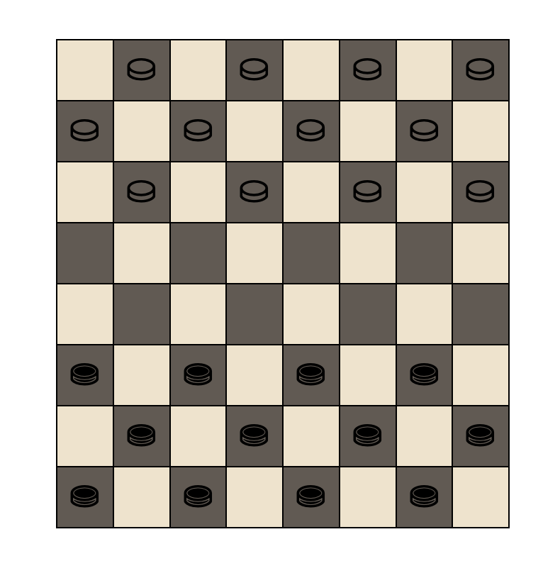

# Checkers-Game

Un jeu de dames simple et intuitif réalisé en HTML, CSS et JavaScript.



## Fonctionnalités :

- Jeu de dames classique pour deux joueurs.
- Possibilité de promouvoir un pion en dame.
- Capture obligatoire quand c'est possible.
- Compteur de score pour les deux joueurs.
- Vérification de fin de jeu lorsque l'un des joueurs n'a plus de pions.

## Installation :

Clonez ce dépôt à l'aide de la commande suivante : ```git@github.com:Malcom-Yeoman/Checkers-Game.git```

## Comment jouer ?

1. Ouvrez le fichier `index.html` dans votre navigateur.
2. C'est au tour du joueur blanc de commencer. Cliquez sur un de vos pions pour le sélectionner.
3. Cliquez sur la case où vous souhaitez déplacer votre pion.
4. Si vous pouvez capturer un pion adverse, cela devient une obligation. Si une capture est disponible, vous devez la réaliser.
5. Après chaque mouvement, c'est au tour de l'autre joueur.
6. Le jeu se termine lorsqu'un des joueurs n'a plus de pions sur le plateau.

## Personnalisation

- **Thèmes** : Changez facilement le thème visuel du jeu en ajustant les variables CSS.
- **Langue** : Adaptez les alertes et les messages du jeu à votre langue préférée en modifiant les chaînes de caractères dans le fichier JavaScript.
- **Règles personnalisées** : Envie d'une variante du jeu ? Modifiez le code pour adapter les règles selon vos préférences.
- **Taille du plateau** : Ajustez le nombre de cases et la taille du plateau en modifiant la structure HTML et les styles associés.

## Contribution

Les contributions sont les bienvenues ! Si vous souhaitez améliorer ce jeu ou ajouter de nouvelles fonctionnalités, n'hésitez pas à soumettre une demande de tirage (pull request).